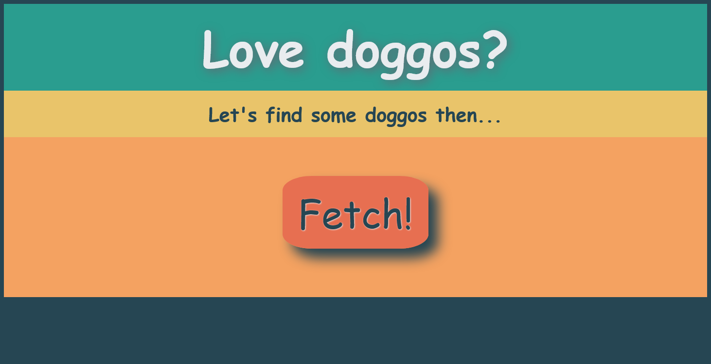
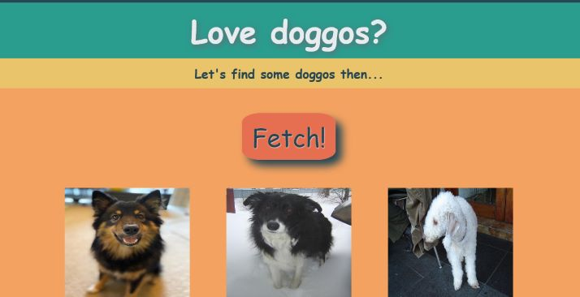

# Get-Doggos!

What are some of the best things the internet has to offer? *Random dog photos!* That's exactly what this is.
So, what are you waiting for? 
Fetch some **[Doggos](https://nabin47.github.io/100-days-of-code/get-doggos/index.html)** now!

## Final Output

## References
- [Frontend Masters course](https://frontendmasters.com/courses/web-development-v2/) Complete Intro to Web Development, v2
- [Dog API](https://dog.ceo/dog-api/documentation/breed)
